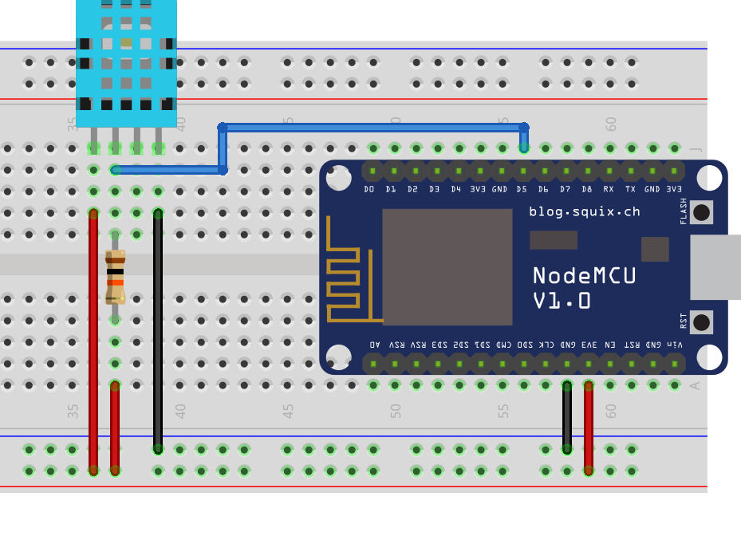

# esp8266-temperature

This code is the base of my self-developed "smart-home" temperature and 
humidity sensor based on an ESP8266 with the DHT11. The measurments are sent
to a MQTT server.

## How does it work
The wiring is really easy. Powered is the ESP8266 with USB or by a power supply
on the VIN pin. The DHT11 sensor works with 5V or 3.3V, so the VCC pin can be connected
to the 3.3V output from the ESP8266 directly. The DATA pin of the DHT11 needs
to be connected to a gpio of the ESP8266. A 10kOhm resistor between the DATA pin and VCC 
should be used to ensure proper communication. For my setup I use the gpio D5 for the 
DATA pin.

For the development and upload of the code I use `platformio`.

## Wiring


## Configuration
Because I use several ESP8266 for different rooms, I made the code
variablized. The configuration can be set inside the file
`include/configuration.h`.
This is a blueprint of the configuration.h:
```c++
#define SSID "<your-ssid>"
#define WLAN_PASSWORD "<your-wifi-password>"

#define DHT_PIN <number-of-the-used-gpio>
#define DHT_TYPE <type-of-the-dht-sensor> // Possible values are DHT11 or DHT22

#define MQTT_SERVER "<mqtt-server-ip-or-dns>"
#define MQTT_HEALTH_TOPIC "<health-topic>"
#define MQTT_TEMPERATURE_TOPIC "<temperature-topic>"
#define MQTT_HUMIDITY_TOPIC "<humidity-topic>"
```
